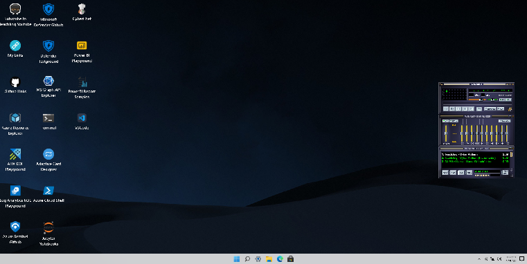

<h2>Hi there, thanks for visiting my profile. 😛  </h2>

 I am a Senior Program Manager in Azure Security CxE at [Microsoft](https://www.microsoft.com) and I am a geek at heart 🤓. 
I often post youtube videos around topics that interest me that could help others out and truly enjoy helping others 🤝!

<h3>Where to find me</h3>

&nbsp;
 &nbsp;
 &nbsp;
 &nbsp;
 &nbsp;

<h3>My current interests currently are:</h3>

<h3>Things I code/play with:</h3>
<!-- https://simpleicons.org -->

<h3>My favorite automation tools</h3>

<h3>Clouds I play in </h3>

<h3>Since you're here...</h3>
Check out my 
 themed desktop at <a href="https://www.teachjing.com">TeachJing.com</a> filled with all my favorite links 📌, playgrounds 🎉 , and demos. 💯🤗
  

 

Shoutouts to [blueedgetechno](https://github.com/blueedgetechno/win11React) for sharing his sweet🍨 source code with the community 🔥! If you want to make one yourself, Just fork his repo and deploy it! (React Javascript knowledge required)

## 🔔 My Latest Github Metrics

<!--
Todo

In future put some skills and endorsements
https://github.com/sw-yx/sw-yx/blob/master/README.md
>

<!--
**teachjing/TeachJing** is a ✨ _special_ ✨ repository because its `README.md` (this file) appears on your GitHub profile.

Here are some ideas to get you started:

- 🔭 I’m currently working on ...
- 🌱 I’m currently learning ...
- 👯 I’m looking to collaborate on ...
- 🤔 I’m looking for help with ...
- 💬 Ask me about ...
- 📫 How to reach me: ...
- 😄 Pronouns: ...
- ⚡ Fun fact: ...
-->

<!-- 
Acknowledgement

Badges - https://github.com/alexandresanlim/Badges4-README.md-Profile
Badges - Shields.io

>

